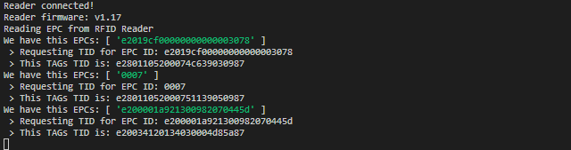

# NodeJS driver for USB RFID UHF readers, curently supporting Chafon CF-RU5102

In one of our projects, we needed to implement basic support for a USB RFID UHF card reader. We use Chafon CF-RU5102.

This library was created (one _./system/rfid-chafon-cf-ru5102.js_ file), which can be easily used in another project based on NodeJS.

Everything is functional on both x86 / a64 and Arm platforms (we have successfully tested both Raspberry Pi and Latte Panda). However, it should not be a problem to use it on both macOS and Windows.

This is what you can see in system log if you scan your tag:

Note: Excuse my English and don't be afraid to fix it :)

## Description of function

Communication with the reader takes place via the USB port (more precisely the serial port consisting of the built-in converter CP210x). Everything is set in the .settings.json file:

    {
    "RU5102": {
        "port": "/dev/ttyRU5102",
        "read_interval": 100,
        "scan_timeout": 10
        }
    }

There are also other parameters:

- _read_interval_: set the value in milliseconds how often the reader should communicate
- _scan_timeout_: set the value in seconds that the reader should ignore the tag after loading successfully before passing it back for processing.

## Supported features

Currently, the library can retrieve the stored EPC number from a card or Tag, and can also read a TID for a particular tag (by modifying the code, however, you can read the contents of the User Memory). In the CF-RU5102 reader it is not possible to read the TID directly. Yes, this reader is not very suitable where it is necessary to read TID primarily.

## Planned features

The library is ready to implement other commands that the reader can do - write data to tags, password protection, and more. So far we have not implemented them because we do not need this functionality at this stage. If you would like to add it in your own commit, you will find the complete reader documentation in the _./documents_ directory.

## License and Use Rights

I will be happy if this code helps you. I didn't find another usable for NodeJS / Linux, so I created it this weekend. You can use it freely for any purpose. But you will be happy if you send me a postcard from your city or state. My address:

    Vlada Janecek
    Drazovice 308
    Rousinov u Vyskova
    Postcode 683 01
    Czech Republic

Yes, __Postcardware__ is still alive! :)

